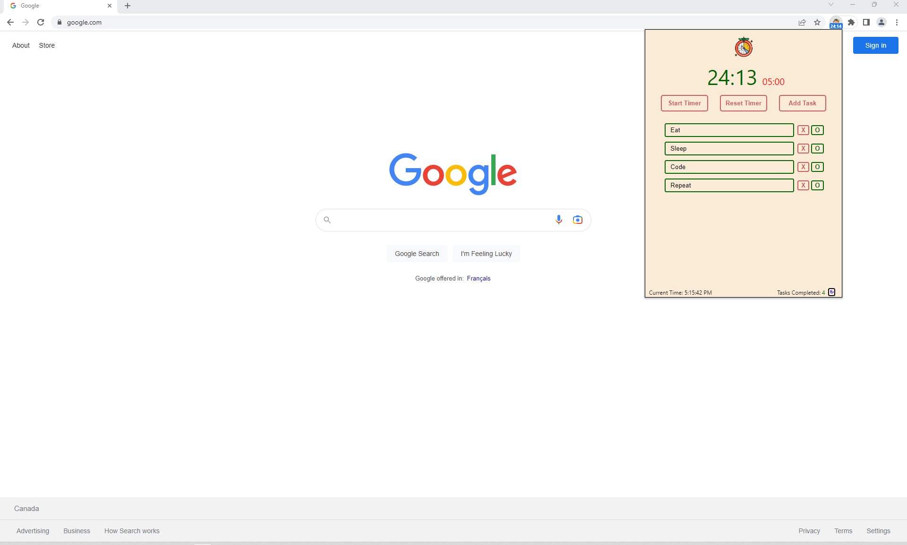

# timerXtension
Custom pomodoro focus timer! Chrome extension built using vanilla JS.
 
This Xtension will help you focus for Xtended amount of time.

## Functionality
* Customise focus and rest time intervals (right click options)
* Create a todo list of tasks to complete in a day
* Track the number of tasks you have completed in a session!
* Get notified when your focus/rest time ends!
 

## Preview

 

## Test it out?
* Clone this repository into local directory
* Navigate to chrome://extensions on your local chrome browser
* Enable Developer mode
* Click on load unpacked and select the folder you cloned.

